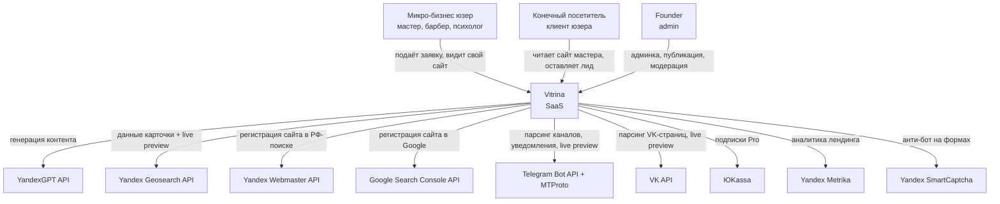
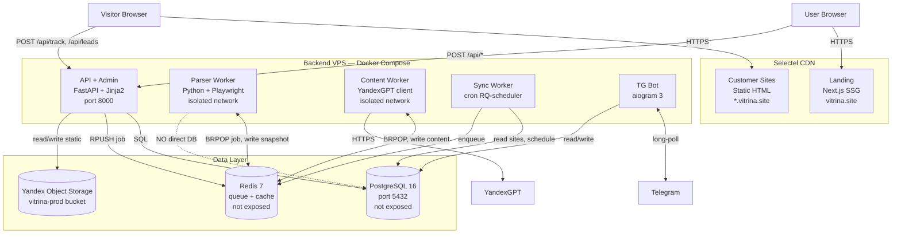
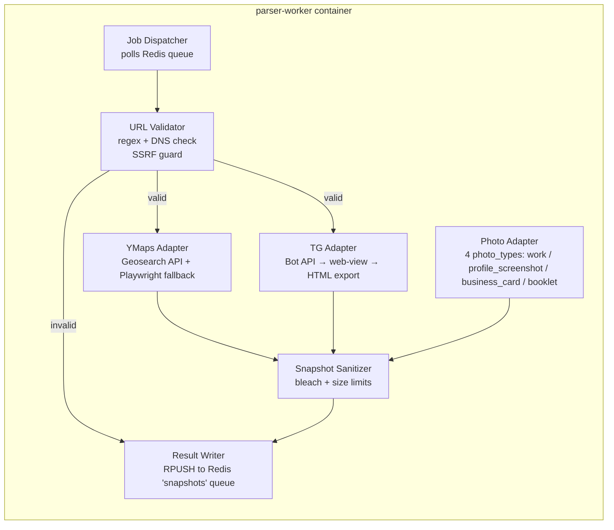
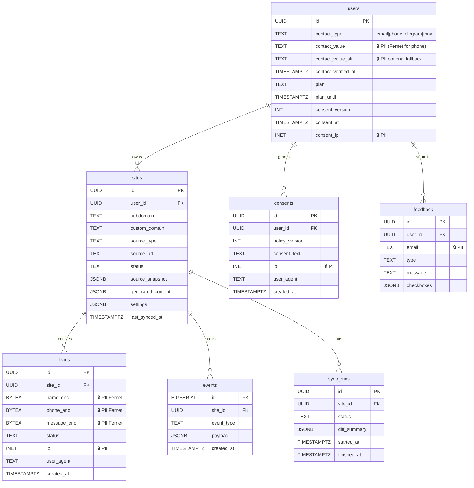
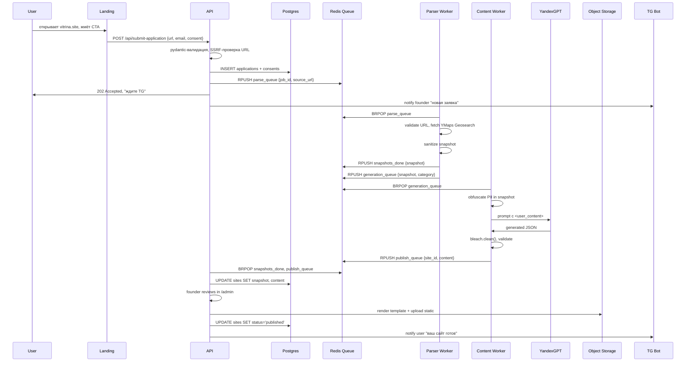
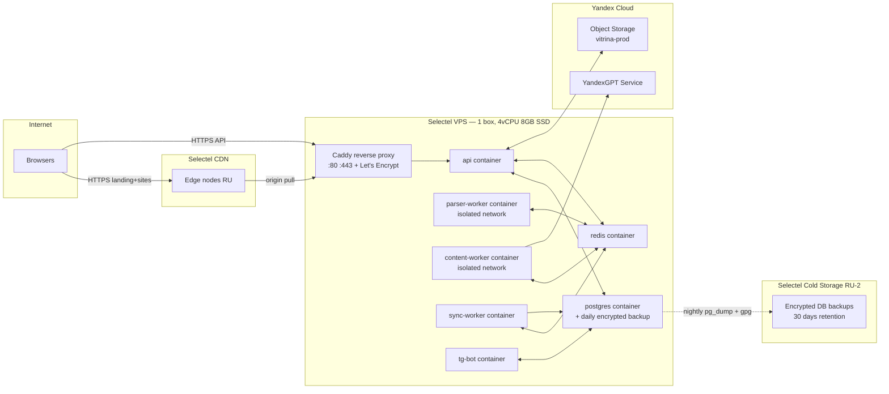

# Vitrina — Architecture

> **TL;DR — Modular monolith на Python+FastAPI с изолированными parser-workers**
> - Один FastAPI-процесс держит API, админку, рендер шаблонов; RQ-воркеры для парсинга и LLM в отдельных Docker-контейнерах без сетевого доступа к БД
> - Postgres + Redis + Yandex Object Storage; вся инфра в РФ (Selectel или Yandex Cloud)
> - Hexagonal-ядро для `parsers/` и `content_generation/` (порты + адаптеры); layered MVC для CRUD-частей (`users/`, `sites/`, `leads/`, `admin/`)

---

## 1. Quality goals (ranked)

1. **Security & compliance** — ПДн юр.лиц и физ.лиц обрабатываются согласно ФЗ-152/ФЗ-420; нулевые утечки приоритетнее скорости
2. **Time-to-MVP < 8 недель** — простота важнее изящества; модульный монолит, не микросервисы
3. **Maintainability solo-разработчиком** — один человек должен понимать всё через 6 месяцев после написания
4. **Performance p95 <300ms (API), <2s (сайт)** — третий приоритет, NOT первый

---

## 2. Constraints

### Technical
- Все данные хранятся в РФ; провайдеры: Yandex Cloud, Selectel, VK Cloud (no AWS/GCP/Azure)
- LLM — только YandexGPT (запрет на отправку ПДн в OpenAI/Anthropic API per ст. 272.1 УК РФ [verify: точная формулировка статьи])
- Wildcard SSL для `*.vitrina.site` через Let's Encrypt DNS-01

### Organizational
- Solo founder, 4-6 часов кодинга/день, остальное — customer development
- Все code-changes идут через Claude Code, ревью человеком обязательно для всего, что трогает `auth/`, `crypto/`, `parsers/`

### Regulatory
- ФЗ-152 (PII): согласие, удаление по запросу, хранение в РФ
- ФЗ-420 (штрафы за утечки PII): до 500M ₽ за повторное нарушение [verify: точная редакция от июля 2024]
- ФЗ-149 (информация): scraping публичных данных в серой зоне; см. ADR-0004, ADR-0005
- РКН-уведомление об обработке ПДн обязательно до запуска формы лидов

---

## 3. C4 Level 1 — System Context



---

## 4. C4 Level 2 — Containers



**Communication summary:**
- API ↔ Workers: только через Redis-очереди (`rq` jobs), never direct calls
- Workers ↔ Postgres: НЕТ прямого доступа; результаты складываются в Redis, API забирает и пишет в PG (защита: даже если worker скомпрометирован через малишес контент, он не видит БД)
- Internal services не слушают на публичных портах; firewall (ufw) разрешает только 80/443/22

---

## 5. C4 Level 3 — Parser Worker (наиболее рискованный контейнер)



**Hexagonal principle here:** `core/parsing/ports.py` определяет интерфейс `SourceParser` (`parse(source_ref) -> SourceSnapshot`); каждый адаптер реализует этот порт. Тесты на core не зависят от внешних API — используют fakes.

**Note on Instagram, VK, MAX, 2GIS, etc.:** Не реализуются в MVP per ADR-0009. Юзеры из IG/VK обслуживаются через `PhotoAdapter` с `photo_type=profile_screenshot` + фото работ. Waitlist-приоритизация через feedback-form (ADR-0009).

---

## 6. Data model



PII-поля помечены `🔒`. Fernet-зашифрованные поля имеют суффикс `_enc` и тип `BYTEA`.

---

## 7. Data flow — S1 (Yandex.Maps → published site)



---

## 8. Tech stack

| Layer | Choice | Why | Alternatives rejected |
|---|---|---|---|
| Backend language | Python 3.12 | Стек parsing+LLM+SQLAlchemy зрелый, founder fluent | Node.js — слабее в data-tasks; Go — overkill для solo MVP; Ruby — экосистема LLM беднее |
| API framework | FastAPI 0.115+ [verify] | Async, pydantic-натив, OpenAPI free | Django — тяжелее; Flask — нет async; Litestar — менее зрелый |
| ORM | SQLAlchemy 2.0 + Alembic | Стандарт PG, миграции, type-checked | Tortoise — менее зрелый; raw SQL — security risk |
| Queue | Redis + RQ | Простой, достаточный для MVP; легко мигрировать на Celery позже | Celery — overkill; Dramatiq — менее популярный; ARQ — async-only, RQ покрывает обе модели через subprocess workers |
| DB | PostgreSQL 16 | JSONB для snapshots, надёжный, бесплатный | MySQL — слабее JSONB; SQLite — не для prod; MongoDB — нет надобности в schema-less |
| Storage | Yandex Object Storage (S3-compatible) | В РФ, ФЗ-152 | Selectel S3 — equivalent (можно как fallback); AWS S3 — НЕТ (трансграничная передача) |
| CDN | Selectel CDN | Поддерживает wildcard, дёшево | Cloudflare — НЕТ (зарубежная); Yandex Cloud CDN — equivalent backup |
| Landing framework | Next.js 14 (App Router) + Tailwind + shadcn/ui | SSR/SSG для SEO, Claude Code хорошо генерит | Astro — отличный для статики, но founder fluency в Next выше; Nuxt — нет преимущества |
| Customer site rendering | Jinja2 → static HTML + Tailwind CDN | Просто, кэшируемо, Lighthouse 95+ легко | Next.js SSG — overkill; Hugo — не нужен скиллсет |
| Admin UI | FastAPI + Jinja2 + htmx | Минимум JS, тот же стек | React-админка — лишняя сложность для соло |
| Encryption | `cryptography.fernet` | Стандарт, AES-128-CBC+HMAC | `pycryptodome` — низкоуровневее; KMS Yandex Cloud — рассмотреть после P0 (ADR-0006) |
| Auth (admin) | `passlib[bcrypt]` + `pyotp` TOTP | Battle-tested | Auth0/Clerk — НЕТ (зарубежные); Keycloak — overkill solo |
| Auth (users) | Magic links via email + Yandex ID OAuth | Без паролей = меньше attack surface | Пароли — нет смысла усложнять |
| LLM | YandexGPT 5 Pro [verify] | В РФ, ФЗ-152 OK для PII | GigaChat — alternative; OpenAI/Anthropic — НЕТ (трансграничная) |
| Parsing | Playwright (Y.Maps), TG Bot API + Telegram HTML export (TG), `vk_api` (VK), `pillow` (фото) | Каждый источник — лучший инструмент. IG не парсим в MVP (см. ADR-0004) | Selenium — медленнее Playwright; Telethon userbot — TG ToS violation (см. ADR-0005); raw requests — YMaps JS-render not работает |
| HTML sanitizer | `bleach` 6.x + `lxml` | Стандарт Python | `html-sanitizer` — менее популярен; manual regex — небезопасно |
| Captcha | Yandex SmartCaptcha | Бесплатно, в РФ | reCAPTCHA — НЕТ (Google); hCaptcha — зарубежный |
| Monitoring | Sentry SaaS (sentry.io) OR self-hosted GlitchTip | Sentry — быстрее; GlitchTip — данные у себя | Datadog/NewRelic — дорого, зарубежные |
| Logs | `structlog` JSON | Single source of truth | `loguru` — менее структурный |
| Tests | `pytest`, `pytest-asyncio`, `hypothesis` (property), `playwright` (e2e) | Стандарт | unittest — verbose |
| Notify TG | `aiogram` 3.x | Тот же бот для парсинга каналов + уведомлений; native async | python-telegram-bot — менее активная разработка |
| Notify MAX | Custom HTTP-client против `platform-api.max.ru` [verify endpoint as of 2026] | Официальный community library (`maxapi-python`) — без VK одобрения, риск для prod (см. [vtemah исследование на февраль 2026]); пишем тонкий HTTP-wrapper | `maxapi-python`, `pymax` — community-проекты, нет SLA |
| Notify SMS | SMS.ru или Yandex Cloud Notify [verify pricing on launch date] | Дёшево (~2-3 ₽/SMS), РФ, простой HTTP API | Twilio — НЕТ (зарубежный); SMSC.ru — equivalent backup |
| Notify Email | SMTP via Yandex Mail для бизнеса OR Selectel Postbox [verify] | В РФ, дешёво | SendGrid/Postmark — НЕТ (зарубежные) |
| CI | GitHub Actions OR Gitea Actions на self-host | Founder operates OpenClaw — self-host вариант есть | Jenkins — overkill |

---

## 9. Architectural style — Modular Monolith

**Решение**: модульный монолит с jasно очерченными bounded contexts. См. ADR-0002.

**Дерево пакетов** (Python):

```
backend/
  app/
    api/              # FastAPI routers, request/response schemas (layered)
    admin/            # admin views, htmx templates
    core/             # domain logic — НЕТ зависимостей от framework
      parsing/        # hexagonal: ports.py + adapters/{ymaps,tg,photos}.py (VK/IG dropped per ADR-0009)
      preview/        # light preview adapters — counts only, <3s budget, fallback to static badge (TG + YMaps)
      content/        # LLM generation, sanitization, hexagonal; vision routing per photo_type
      publishing/     # template rendering, S3 upload
      seo/            # multi-engine submission: Яндекс.Вебмастер + IndexNow + GSC API
      auth/           # бизнес-логика логина/2FA
      consent/        # PII consent ledger
      leads/          # encryption, decryption, rate limit logic; core promise «сам ловит заявки»
      waitlist/       # source_request aggregation (ADR-0009); thresholds + admin alerts
      notify/         # dispatcher + channels (telegram/max/email/sms) — ADR-0008
      billing/        # tariffs, subscriptions
    infrastructure/   # adapters concrete: postgres repos, redis client, s3 client, ygpt client
    workers/          # rq worker entrypoints
    bot/              # aiogram handlers
    utils/            # logging, errors, security helpers
  alembic/
  tests/
    unit/             # на core/, без I/O
    integration/      # с реальными PG+Redis в Docker
    e2e/              # Playwright против локального стенда
    security/         # SSRF, prompt-injection, XSS, authz negative
```

**Dependency rule (хексагональное ядро для critical paths):**
- `core/parsing/`, `core/content/`, `core/auth/`, `core/leads/` — никогда не импортируют из `infrastructure/` или `api/`
- Зависимости идут только внутрь: `api/` → `core/`, `infrastructure/` → `core/`
- Линтер: `import-linter` с правилами в `.importlinter`

**Что НЕ-хексагонально (layered MVC):**
- `api/` routers, `admin/` views, простой CRUD над `users/`, `feedback/` — без портов, прямые вызовы репозиториев

---

## 10. Deployment topology



**Network policies в `docker-compose.yml`:**
- `internal_network` — для api+pg+redis
- `parser_network` — для parser-worker, нет связи с pg
- Bridge только через redis (queue messages)

**Secrets:**
- Все секреты в Docker secrets, не в env-файлах на диске
- Production `.env` существует только в `/run/secrets/...` смонтированный read-only

---

## 11. Cross-cutting concerns

### Logging
- `structlog` JSON во всех контейнерах
- Корреляция: `request_id` генерится в API middleware, прокидывается в Redis-job payload, прокидывается во все логи воркера
- Уровни: `DEBUG` only in dev; `INFO+` in prod
- PII-redaction adapter поверх structlog: regex-маскирует phone/email до записи

### Tracing
- MVP: нет distributed tracing (OpenTelemetry — overkill для 1 VPS)
- M3+: рассмотреть SigNoz self-hosted если будут >3 контейнеров

### Error handling
- `core/` возвращает `Result[T, DomainError]` (используем `result` library OR простой `Union[T, E]`)
- `api/` ловит DomainError в middleware → mapped HTTP response
- Никакие стэк-трейсы НЕ уходят клиенту — только Sentry

### Feature flags
- MVP: env-vars (`FEATURE_AUTO_SYNC=false`)
- M3+: `unleash` self-hosted если потребуется percentage-rollout

### Config
- Pydantic Settings (`pydantic_settings`) одна `Settings` class, загружает из env, валидирует на старте
- Конфиг fail-fast — приложение не стартует если обязательная переменная отсутствует

---

## 12. Trade-offs accepted

| Чем пожертвовали | Что получили | Когда пересмотреть |
|---|---|---|
| Не используем Celery (используем RQ) | -2 дня setup time, проще debug | При >1000 jobs/min |
| Один монолит-процесс, не микросервисы | -1 неделя инфра-работы | Когда станет ≥3 разработчиков |
| Нет distributed tracing | -3 дня setup | Когда p95 проблемы и >5 контейнеров |
| Нет HA для Postgres (single instance + nightly backup) | -10k ₽/мес инфры, -1 неделя | Когда uptime SLA нужен 99.9% |
| Customer sites — статика, не PWA | -1 неделя; Lighthouse 95+ "из коробки" | Когда юзеры запросят offline |
| Ручная модерация заявок первые 20 сайтов | -2 недели automation work + ручной QA AI-генерации | После 20 успешных автогенов |
| Wildcard SSL ОДИН сертификат, не per-site | -3 дня Let's Encrypt automation | Если будут кастомные домены массово |

---

## 13. Open questions

- **OQ-A1**: Selectel CDN поддерживает кэширование при HTTPS wildcard на `*.vitrina.site` без отдельной настройки на каждый поддомен? [verify: Selectel CDN docs]
- **OQ-A2**: YandexGPT 5 Pro лимиты per-folder — 100 req/sec? Достаточно для 100 сайтов/день? [verify: Yandex Cloud quotas]
- **OQ-A3**: Альтернатива Telethon-аккаунту с виртуальным номером — насколько стабильно? Acceptable risk?
- **OQ-A4**: Где хранить Fernet master key для backup decryption если все сервисы упали? Yandex Cloud KMS [verify: KMS pricing] или manual в 1Password/паре бумажных копий в сейфе?
- **OQ-A5**: MAX Bot API endpoint stability — нужно ли держать `botapi.max.ru` как fallback наряду с `platform-api.max.ru`? [verify migration deadline as of launch]
- **OQ-A6**: Selectel Postbox vs Yandex Mail для бизнеса для SMTP — final pick before T1.6
- **OQ-A7**: SMS.ru vs Yandex Cloud Notify для SMS — pricing per SMS and reliability comparison before T1.6c
