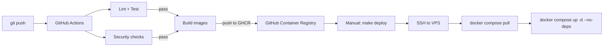

# Vitrina — Deployment

> **TL;DR — single VPS, Docker Compose, manual deploy via Makefile**
> - 1 Selectel VPS (4 vCPU, 8GB RAM, 80GB SSD) → ≈1500 ₽/мес
> - Docker Compose с 5 контейнерами (api, parser-worker, content-worker, sync-worker, tg-bot) + postgres + redis + caddy
> - Деплой: `git push` → CI passes → founder runs `make deploy` (SSH+rsync); rollback via `make rollback`

---

## 1. Environments

| Env | Purpose | Where | Data |
|---|---|---|---|
| `local` | Developer machine | Founder laptop | Synthetic only |
| `staging` | Pre-release smoke + pen-test target | Same VPS, separate Docker network, separate domain `staging.vitrina.site` | Synthetic only |
| `production` | Live traffic | Selectel VPS Moscow region | Real PII (encrypted) |

---

## 2. Infrastructure as Code

- **No Terraform in MVP** (single VPS, low churn). Selectel resources созданы вручную, задокументированы в `infra/INFRA.md`.
- **All runtime config**: Docker Compose YAML + Caddyfile + cron jobs in `infra/`.
- **Future**: migrate to OpenTofu OR Pulumi if infra grows ≥3 servers.

---

## 3. CI/CD pipeline



**Pipeline stages** (all in `.github/workflows/`):
1. `lint.yml` — ruff, mypy, eslint
2. `test.yml` — pytest unit + integration + security subset
3. `security.yml` — bandit, pip-audit, npm audit, gitleaks
4. `build.yml` — `docker build` + push to GHCR с tag `sha-<commit>`
5. `e2e.yml` — Playwright против ephemeral staging container
6. `deploy.yml` — workflow_dispatch (manual button); SSH-ed to VPS, run `make deploy`

**Image tagging**: `ghcr.io/founder/vitrina-api:sha-abc1234` (immutable); production compose pinned to specific SHA after manual approval.

---

## 4. Deployment topology

См. ARCHITECTURE.md §10. Reiteration:

```
Selectel VPS (Moscow, 4 vCPU, 8 GB RAM, 80 GB SSD, ~1500₽/mo)
├─ caddy (host network for ports 80/443)
├─ Docker networks:
│   ├─ internal_net (api ↔ postgres ↔ redis ↔ tg-bot ↔ sync-worker)
│   └─ parser_net (parser-worker, content-worker — NO route to postgres)
│   Bridge: redis is in BOTH networks → only queue is path between
└─ Volumes:
    ├─ pgdata (postgres persistent)
    ├─ redisdata (redis persistent)
    └─ ./logs (mounted to all containers)

External:
├─ Yandex Object Storage (vitrina-prod bucket) — static sites, photos
├─ Selectel Cold Storage — encrypted DB backups (cross-region)
└─ Selectel CDN — caches *.vitrina.site
```

---

## 5. Rollback strategy

- **Code rollback**: `make rollback` retrieves previous image SHA from `infra/.last-deploy`, runs `docker compose up -d --no-deps` with old images
- **DB rollback**: Alembic supports `alembic downgrade <revision>`; every migration MUST have working downgrade
- **Data rollback**: restore from most recent nightly backup → manual process via `make restore-backup TIMESTAMP=...`
- **Practiced**: monthly drill, time-to-rollback target <10 minutes

---

## 6. Observability stack

| Concern | Tool | Hosted where |
|---|---|---|
| Application logs | structlog JSON → Docker logs driver → local files | VPS, rotated daily, ship to S3 weekly |
| Errors | Sentry SaaS RU region [verify availability] OR self-hosted GlitchTip | external OR VPS |
| Uptime | UptimeRobot или Better Stack (free tier) | external, multi-region pings |
| Metrics (basic) | Custom `/metrics` endpoint (Prometheus format), scraped by self-hosted Prometheus в M3+ | n/a in MVP |
| Alerts | TG @VitrinaOpsBot bot | bot deployed alongside |

---

## 7. Runbooks (stubs to expand)

| Runbook | Location | Triggers |
|---|---|---|
| `runbooks/incident-pii-breach.md` | docs/runbooks/ | Suspected PII leak |
| `runbooks/postgres-down.md` | docs/runbooks/ | Postgres container restart loop |
| `runbooks/yandexgpt-outage.md` | docs/runbooks/ | YandexGPT 5xx persistent |
| `runbooks/secret-rotation.md` | docs/runbooks/ | Quarterly OR on suspected leak |
| `runbooks/restore-from-backup.md` | docs/runbooks/ | Data loss event |
| `runbooks/admin-locked-out.md` | docs/runbooks/ | Founder lost TOTP device |
| `runbooks/dns-loss.md` | docs/runbooks/ | Domain DNS failure |
| `runbooks/cdn-purge.md` | docs/runbooks/ | Stale content propagation |

Каждый runbook содержит: triggers, severity, oncall steps numbered, rollback, post-mortem template link.

---

## 8. Cost estimate per environment

| Item | Local | Staging | Production (100 sites, M3) |
|---|---|---|---|
| VPS | 0 | included in prod VPS (separate compose project) | 1500 ₽/мес |
| Postgres | 0 | included | included |
| Redis | 0 | included | included |
| Object Storage (sites) | 0 | minimal | ~100 ₽/мес (10GB) |
| CDN bandwidth | 0 | minimal | ~500 ₽/мес (100GB) |
| Cold Storage (backups) | 0 | 0 | ~100 ₽/мес (30 backups × 1GB) |
| YandexGPT tokens | 0 | minimal test | ≤3000 ₽/мес (100 sites × 5 generations × 6₽) [verify pricing] |
| Yandex Geosearch API | 0 | minimal | within free tier (1000 req/day) [verify] |
| Yandex SmartCaptcha | 0 | minimal | free (within 1000 req/day) [verify] |
| SMS notifications (SMS.ru) | 0 | minimal | ~500 ₽/мес (200 post-publish sends × 2.5₽) [verify pricing] |
| Email (Yandex Mail для бизнеса) | 0 | minimal | included in domain plan [verify] |
| MAX-bot | 0 | 0 (until verified) | free (post-verification, no per-message cost) |
| TG-bot | 0 | 0 | free |
| Domain `.site` | 0 | 0 | ~2000 ₽/год → 167 ₽/мес |
| **Total ≈** | 0 | included | **5900 ₽/мес** |

Slight over the 5000 cap из NFR — main variable: SMS volume и YandexGPT spend. Митигейшн при превышении: SMS opt-out флаг в личном кабинете (юзер выбирает не получать SMS post-publish).

---

## 9. Backup & restore policy

- **Schedule**: nightly 03:00 MSK
- **What**: `pg_dump --format=custom --no-owner` + S3 bucket listing snapshot
- **Encryption**: `gpg --symmetric --cipher-algo AES256` with `BACKUP_PASSPHRASE` (separate from Fernet)
- **Where**: Selectel Cold Storage RU-2 (cross-region from prod VPS)
- **Retention**: 30 days
- **Restore drill**: monthly, documented in `runbooks/restore-from-backup.md`, time-to-restore target <30 minutes for full DB

---

## 10. Disaster recovery (informal RTO/RPO)

- **RTO** (recovery time objective): 4 hours (manual VPS rebuild from snapshot + restore)
- **RPO** (recovery point objective): 24 hours (loss of up to one day of data acceptable for MVP)
- **Re-evaluation**: when reaching 50 paying users OR B2B clients requiring formal SLA

---

## 11. Pre-deploy checklist

- [ ] CI green on `main`
- [ ] Alembic migrations: dry-run on staging passed
- [ ] Image SHA confirmed in `infra/.last-deploy.next`
- [ ] Backup of production DB taken (timestamped) in last 24h
- [ ] No active incidents in @VitrinaOpsBot
- [ ] Founder has 30 minutes uninterrupted

---

## 12. Open questions

- **OQ-D1**: Selectel или Yandex Cloud для VPS — итоговый выбор? Selectel дешевле, YC более интегрирован с YandexGPT/Object Storage. **Решение до T0.3.**
- **OQ-D2**: Self-hosted GlitchTip vs Sentry SaaS RU — finalized после verification доступности Sentry в RU-region.
- **OQ-D3**: Когда переходить с manual deploy на auto-deploy после merge to main? Trigger: 1 month of zero-incident manual deploys.
